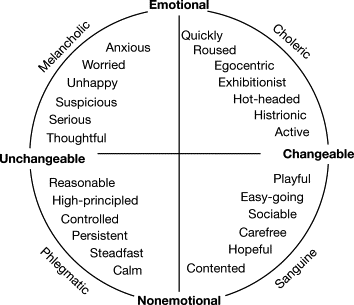
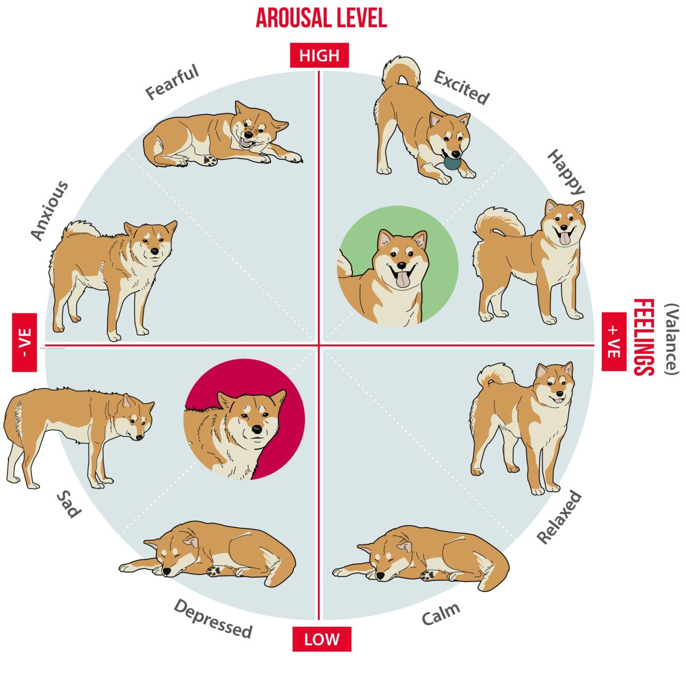

# Virtual Pet Management System

Welcome to the Virtual Pet Management System! This system is designed to help you manage a variety of pets and related activities, including Cats, Dogs, RoboticDogs, RoboticCats, Shelters, Volunteers, Adopters, Pet Maintenance Tasks, and admitting pets.

## Table of Contents

- [Virtual Pet Management System](#virtual-pet-management-system)
  - [Table of Contents](#table-of-contents)
  - [Introduction](#introduction)
  - [Features](#features)
  - [Usage](#usage)
  - [Models](#models)
    - [Cats](#cats)
    - [Dogs](#dogs)
    - [RoboticDogs](#roboticdogs)
    - [RoboticCats](#roboticcats)
    - [Shelters](#shelters)
    - [Volunteers](#volunteers)
    - [Adopters](#adopters)
    - [Pet Maintenance Tasks](#pet-maintenance-tasks)
    - [Pet Schedule Tasks](#pet-schedule-tasks)
  - [Enums](#enums)
    - [Pet Temperaments](#pet-temperaments)
    - [Pet Moods](#pet-moods)
    - [Pet health](#pet-health)
    - [Robotic Health](#robotic-health)
  - [User Stories](#user-stories)

## Introduction

The Virtual Pet Management System is a comprehensive platform for managing pets, shelters, volunteers, adopters, and maintenance tasks. It allows you to keep track of various types of pets, both real and robotic, in different shelters while facilitating the adoption process and pet care.

## Features

- Create, update, and delete records for different types of pets, including Cats, Dogs, RoboticDogs, and RoboticCats.
- Manage pet shelters and their details.
- Keep track of volunteers who help take care of the pets.
- Maintain a List of adopters interested in adopting pets.
- Schedule and track pet maintenance tasks.
- Admit new pets to shelters and update their information.
- Each Pet will have a tick event based on time.
  - pets will need maintance items perform by a volunteer
  - if the pet is not cared for it could pass away.
- Each Volunteer will have a tice event base on time.
  - volunteers will have schedule task to perform.
- Time based each minute real time = 5 hours of shelter time.

## Usage

Once the system is up and running, you can perform the following actions through the user interface:

- Add, update, and remove pet records.
- Manage shelter information and locations.
- Track volunteers' schedules and activities.
- Keep a record of adopters and their preferences.
- Schedule and assign maintenance tasks to volunteers.
- Admit new pets to shelters and update their profiles.

For detailed instructions on how to use the system, please refer to the user documentation.

## Models

### Cats
The `Cats` entity represents domestic cats.
  - id
  - name
  - breed
  - age 
  - health (enum) [Pet health](#pet-health)
  - mood (enum) [Pet Moods](#pet-moods)
  - temperment (enum) [Pet Temperaments](#pet-temperaments)
  - Fixed (true, false)
  - image url
  - shelterId
  
### Dogs
The `Dogs` entity represents various dog breeds.
  - id
  - name
  - breed
  - age 
  - health (enum) [Pet health](#pet-health)
  - mood (enum) [Pet Moods](#pet-moods)
  - temperment (enum) [Pet Temperaments](#pet-temperaments)
  - Fixed (true, false)
  - image url
  - list of task
  - shelterId

### RoboticDogs

The `RoboticDogs` entity represents robotic dogs used for various purposes.
  - id
  - name
  - model
  - manufacturer
  - energy level
  - oil level
  - health (enum) [Robotic Health](#robotic-health)
  - image url
  - list of task
  - shelterId

### RoboticCats

The `RoboticCats` entity represents robotic cats.
  - id
  - name
  - model
  - manufacturer
  - energy level
  - oil level
  - health (enum) [Robotic Health](#robotic-health)
  - image url
  - list of task
  - shelterId

### Shelters

The `Shelters` entity represents pet shelters and their information.
  - id
  - name
  - address
  - city
  - state
  - zip
  - phone
  - email
  - list of pets
  - Web Site
  - image url
  
### Volunteers
The `Volunteers` entity represents individuals volunteering to care for pets.
  - id
  - name
  - address
  - city
  - state
  - zip
  - phone
  - email
  - image url
  - list of shelters
  - list of pets to care for
  
### Adopters
The `Adopters` entity represents potential pet adopters and their preferences.
  - id
  - name
  - address
  - city
  - state
  - zip
  - phone
  - email
  - perfer
  - image url
  
### Pet Maintenance Tasks
The `Pet Maintenance Tasks` entity represents tasks related to the care and maintenance of pets.
  - id
  - name
  - frequency
  - type of pet
  - effected property

### Pet Schedule Tasks
The `Pet Schedule Tasks` entity represents schedule tasks related to the care and maintenance of pets.
  - id
  - volunteer Id
  - pet id
  - task id
  - next schedule time

## Enums
### Pet Temperaments

### Pet Moods

### Pet health
    HEALTHY
    HUNGRY
    SICK
    DEAD

### Robotic Health 
    NORMAL
    LOW_BATTERY
    MALFUNCTION
    DESTROYED

## User Stories
**You should have Junit Test for all of the user stories**

    1. As a shelter manager, I want to be able to add a new pet (Cat, Dog, RoboticDog, RoboticCat) to the system so that I can keep track of all the pets in the shelter.

    2. As a shelter manager, I want to update the details of a pet (name, breed, age, etc.) so that I can maintain accurate records.

    3. As a shelter manager, I want to remove a pet from the system when it gets adopted so that I can keep the database up-to-date.

    4. As a shelter manager, I want to see a list of all the pets in my shelter so that I can quickly review their information.

    5. As a volunteer, I want to view the schedule of my assigned pet maintenance tasks so that I know when and which tasks I need to perform.

    6. As a volunteer, I want to mark a maintenance task as complete after I have finished it to update the task's status.

    7. As a potential adopter, I want to search for pets based on criteria like type, breed, and age so that I can find a pet that matches my preferences.

    8. As a potential adopter, I want to view detailed information about a pet, including its name, age, and shelter location, to help me make an informed decision.

    9. As an adopter, I want to submit an adoption request for a specific pet so that I can begin the adoption process.

    10. As an adopter, I want to see the status of my adoption request to know if it has been approved or denied.

    11. As a shelter manager, I want to admit a new pet to the shelter and provide details such as type, breed, age, and address.

    12. As a shelter manager, I want to update the shelter's address and other information in the system.

    13. As a shelter manager, I want to assign volunteers to specific pets and tasks to ensure efficient care and maintenance.

